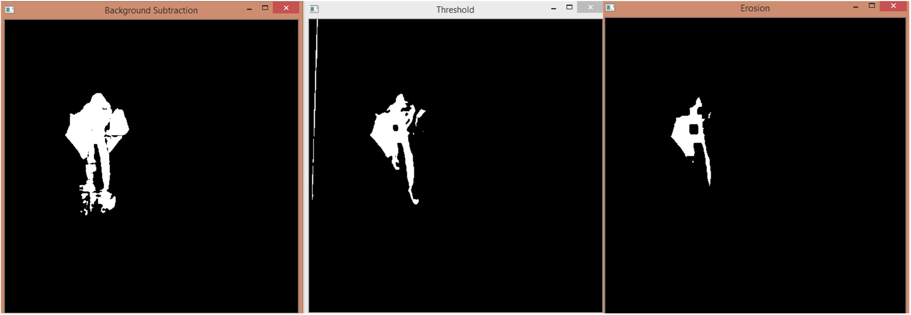
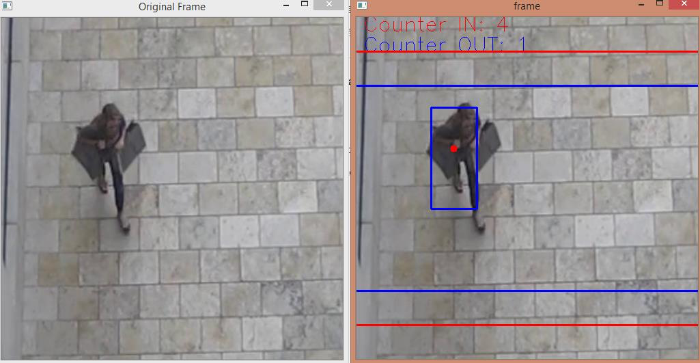
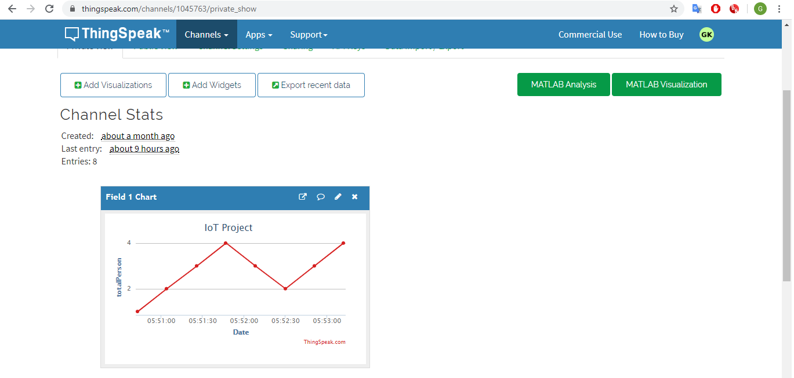
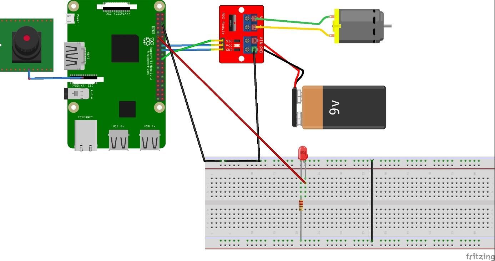

# Person_Counter_with_Computer_Vision

## About the Project
This project was prepared as the final assignment of "EEES 406 – Data Analytics for IoT" course during my bachelor in Çukurova University.

The main parts of the project are :
- Detecting person and deciding their walking direction on the video and counting them. 
- Sending this information to the cloud system.
- Receiving these data and train a model with them to obtain a relationship between the number of people and the hours.
- Controlling some systems with Raspberry Pi according to the total number of person.

---

## Computer Vision Part

The OpenCV was used to detect person on video data by using various classical computer vision techniques. For example _"cv2.BackgroundSubtractorMOG()"_ method subtract the each coming frame from the fixed background. 

But the used method is as follow : 
Converting the frame into gray scale with _"cv2.cvtColor(frame, cv2.COLOR_BGR2GRAY)_", then applying threshold with _"cv2.threshold()_" and removing noises with _"cv2.erode()"_

  

Next, I used _"cv2.findContours"_ method to find contours in frame(The contour is a curve that connects all pixels of the same color along the border). And calculated their areas. Because when the area is greater than a specified value, that contour is considered as a person.

Then a rectangle is drawn around the detected person and by checking the center point and its change, their walking direction is found. 

  

---

## Cloud and Model Part
The next part is, sending the data to the cloud system and taking it from there. This part was made with _"ThingSpeak"_ cloud service. Then this data was taken from the cloud and saved in a csv file.(It did not used directly, because it was necessary condition for final assignment)

After that, a model was trained with total person and hour data and a relationship between them was obtained. Thus, it can be estimated how crowded a place will be at what times of the day.

  

---

## System Design Part

### Components Used
- Raspberry Pi 3 Model B+
- Raspberry Pi Camera Module V1.3
- L298N Motor Driver
- DC motor and LEDs

The following system represents a closed area. The Leds represents the lighting system and the DC motor represents ventilation system in real life. Using the total number of people data, they are controlled simultaneously with the Raspberry Pi. For example the idea is, when people start to get crowded, the ventilation system works faster.

